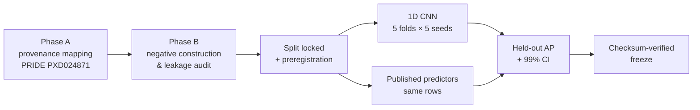

<div align="center">

# PXD024871 · Sequence-only CNN benchmark

**Can a 1D CNN tell real HLA class-I peptides from decoys using sequence alone — and how does it compare with published presentation predictors on identical rows?**

[](../FREEZE_RECORD.md)
[](../PREREGISTRATION.md)
[](#-limits-read-before-reusing)
[](https://www.ebi.ac.uk/pride/archive/projects/PXD024871)
<br>
[](../requirements.txt)
[](../scripts/train_cnn.py)
[](../LICENSE)
[](../LICENSE-docs)

[Key results](#-key-results) · [How it works](#-how-the-study-was-run) · [Repository map](#-repository-map) · [Reproduce](#-verify-and-reproduce) · [Cite](#-citation) · [Full technical README](../README.md)

</div>

---

## 🔬 At a glance

| | |
|---|---|
| **Question** | Does a sequence-only 1D CNN separate observed HLA class-I ligands from matched decoys? |
| **Data** | One public cohort (PRIDE PXD024871) · 52 participants · 10 held-out test units |
| **Compared with** | MHCflurry 2.0.0 & 2.3.0 · NetMHCpan 4.1 · MixMHCpred 3.0 |
| **Design** | Preregistered before any model was trained · 38 logged decisions · QC gates · checksum-verified freeze |
| **Take-away** | The CNN leads, but the predictors' near-identical scores suggest that lead may partly reflect this cohort's decoy construction. A second cohort is needed. |

---

## 📊 Key results

<div align="center">
  
</div>

<br>

**Primary endpoint (held-out units)**

| Measure | Value |
|---|---|
| Average precision | **0.7551** (99% CI 0.7368–0.7721) |
| Same model, leakage-free rows only | 0.7056 — the 0.0495 gap is sequence overlap, measured rather than assumed |
| Composition-only LDA floor | 0.597 pooled |
| Cross-platform transfer (LTQ ↔ Lumos) | 0.6959 / 0.7108 |
| Allele-exclusive signal (A\*02:01) | +0.0476 (99% CI +0.0314 to +0.0626), 9/9 units |

**Head-to-head on 165,574 shared rows** (prevalence 0.440)

| System | Mean AP |
|---|---|
| CNN (this work) | **0.6852** |
| MHCflurry 2.3.0 | 0.5479 |
| NetMHCpan 4.1 | 0.5472 |
| MHCflurry 2.0.0 | 0.5443 |
| MixMHCpred 3.0 | 0.5434 |

> [!IMPORTANT]
> **Read this as a negative result about the comparison, not a win for the CNN.** Four independently built predictors span only 0.0046 AP, and training-set size buys nothing. The more cautious reading is that the CNN partly fits how this cohort's negatives were built. The [full README](../README.md#what-was-found) explains the argument.

---

## 🧭 How the study was run



Each stage is blocked by a QC gate (records in [`results/qc/`](../results/qc)). The detailed diagrams are in [`FLOWCHART.md`](../FLOWCHART.md).

Every decision, reversal and withdrawn analysis is kept on the record in [`DECISION_LOG.md`](../DECISION_LOG.md) — including two occasions where a bug produced the most flattering number and had to be withdrawn.

---

## 🗂 Repository map

| Path | What's inside |
|---|---|
| [`PREREGISTRATION.md`](../PREREGISTRATION.md) | Hypotheses, estimand and artifact hashes, committed before training |
| [`DECISION_LOG.md`](../DECISION_LOG.md) | D001–D038: every decision and every reversal |
| [`DATA_SOURCES.md`](../DATA_SOURCES.md) | Twelve provenance fields per source |
| [`FLOWCHART.md`](../FLOWCHART.md) | Pipeline shape |
| [`FREEZE_RECORD.md`](../FREEZE_RECORD.md) | What the freeze verifies |
| [`scripts/`](../scripts) | Pipeline, QC and figure scripts |
| [`results/figures/`](../results/figures) | Figures F7–F13 (SVG) |
| [`results/qc/`](../results/qc) | QC gate records |
| [`results/model/`](../results/model) | Endpoint artifacts and model weights |
| [`notebooks/`](../notebooks) | Colab runners used for bulk extraction |

<details>
<summary><b>Documents not published here</b></summary>

<br>

Nine project documents (including `REPORT.md`) are withheld at the owner's decision (D038), pending submission. As a result, `scripts/freeze.py --verify` will not fully pass on a public clone. The [full README](../README.md#documents-not-published-here) gives the details. To ask for any of them, open an issue.

</details>

---

## ♻️ Verify and reproduce

```bash
pip install -r requirements.txt               # plus a torch build for your machine
python3 scripts/train_cnn.py --mode selftest  # encoder, AP, gradients, overfit
python3 scripts/make_figures.py               # regenerates F7–F13 from results/*.json
```

Full re-execution needs the PRIDE payloads (tens of GB; URLs and digests are committed) and the predictors installed under their own licences. Seeds are derived deterministically ([`scripts/seeds.py`](../scripts/seeds.py)).

---

## ⚠️ Limits (read before reusing)

- **Not peer reviewed.** One cohort, 52 participants, 10 held-out test units.
- The CNN's lead may reflect negative construction rather than presentation biology.
- **Licence carve-outs:** MixMHCpred-derived files are academic non-commercial only, and NetMHCpan 4.1's licence restricts publishing benchmark results. See [Licensing](../README.md#licensing).

---

## 📝 Citation

Use GitHub's **"Cite this repository"** button or [`CITATION.cff`](../CITATION.cff). Please also cite the PRIDE deposit and any predictor whose output you reuse. This is an independent reanalysis, not affiliated with the original depositors.

---

<div align="center">

**Md Hafijur Rahman** · MSc Biomedical Technology, Dokuz Eylül University

[](https://github.com/Hafij-BGE)
[](https://orcid.org/0000-0003-4031-6475)

<sub>Corrections welcome — especially from anyone with a second immunopeptidomics cohort who can try to break the 0.6852.</sub>

</div>
