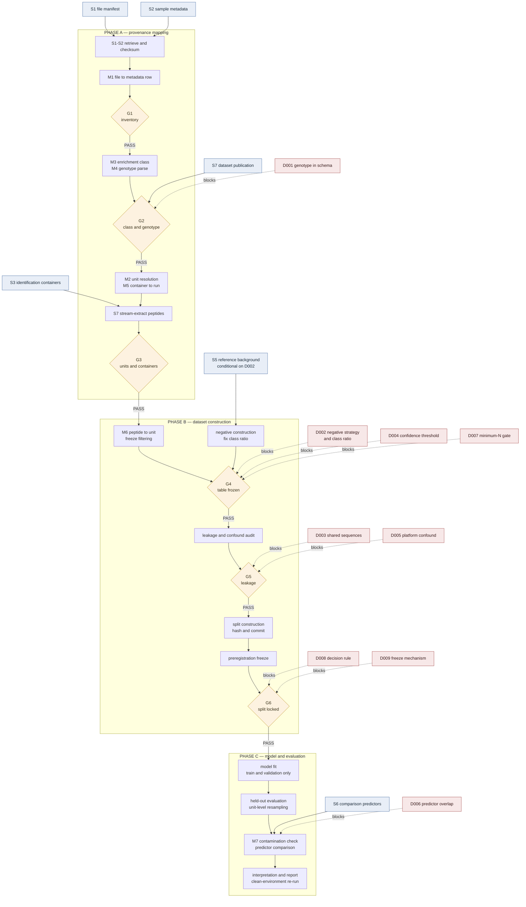
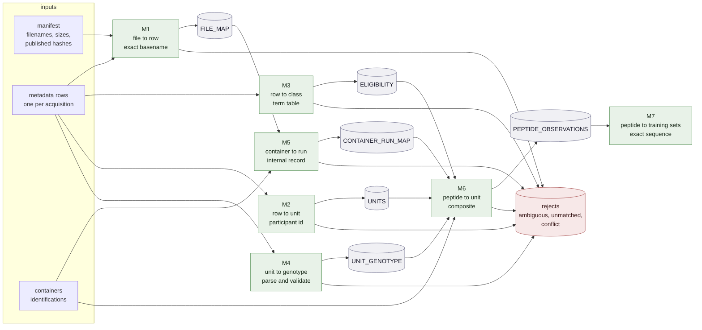
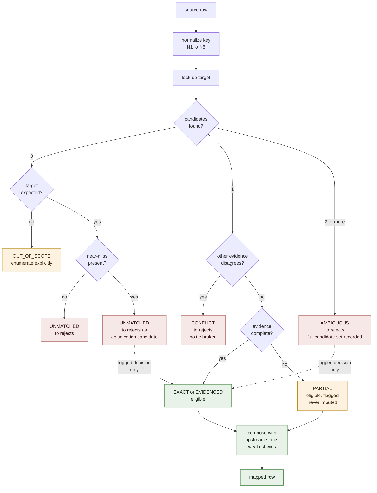
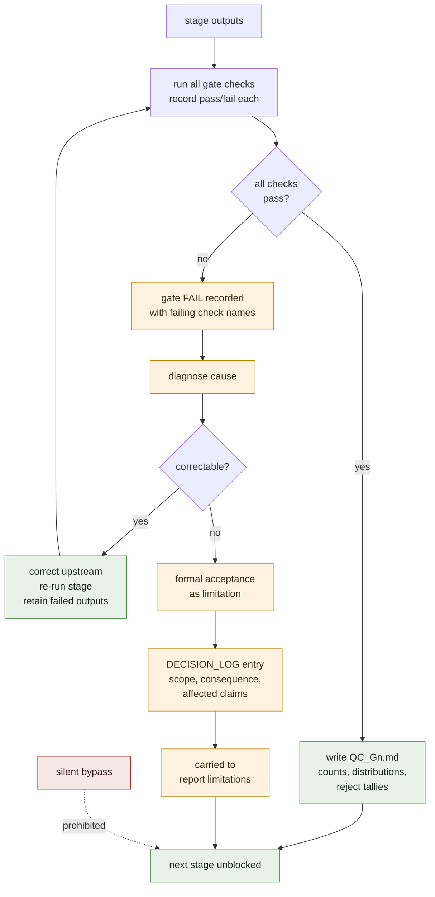
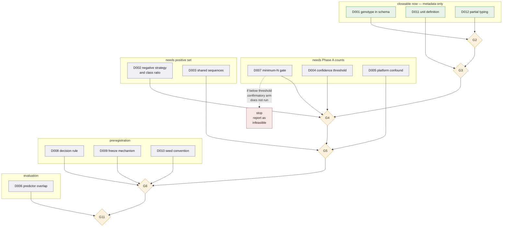
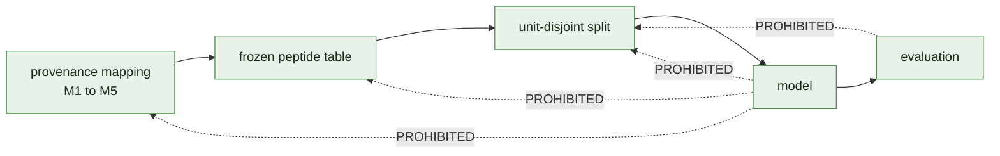

# FLOWCHART

Diagrammatic view of `METHODOLOGY.md`. The specification is authoritative;
these diagrams are navigation aids and must be updated when it changes.

Diagrams are Mermaid and render on GitHub. Each is also described in text
beneath it, so the document is readable where Mermaid does not render.

---

## 1. Master pipeline

Sources, stages, gates, and the decisions that block them.

**In text:** seven sources feed three phases. Phase A resolves provenance and
ends at G3 with every eligible acquisition assigned to a unit with a class and
a genotype. Phase B builds and freezes the analysis table and the split. Phase
C fits and evaluates. Dotted edges are open decisions; each must be `RESOLVED`
before the gate it points at can pass. Phase A is blocked only at G2, by D001;
everything from G4 onward is blocked by multiple open decisions.

---

## 2. Mapping dataflow

How the seven mappings compose, and what each emits.

**In text:** M1 joins the manifest to the metadata rows on exact normalized
basename. M2, M3 and M4 each read the metadata rows independently and emit
units, class eligibility, and genotypes. M5 joins containers to acquisitions by
reading each container's own record of its inputs, not by parsing filenames.
M6 composes all of it into the peptide observation table, inheriting the
weakest status along each row's chain. M7 reads the frozen table only. Every
mapping has a second output edge into the rejects store — no mapping drops a
row silently.

---

## 3. Per-row status resolution

The decision procedure every join applies to a single source row. This is where
"never silently force an ambiguous match" is operationalized.

Since `METHODOLOGY.md` was restructured to the prompt's eleven-field format,
these status values are defined **per mapping**, under each one's
*Confidence/status categories* field, rather than in a single shared vocabulary.
Not every mapping uses every value. The diagram shows the common procedure;
each mapping's own field is authoritative for which statuses it can produce.

**In text:** a row with zero candidates is either `OUT_OF_SCOPE` — no target was
expected, and the category is enumerated so it cannot absorb real failures — or
`UNMATCHED`. A near-miss is still `UNMATCHED`; it is recorded as a candidate for
human adjudication but is never auto-repaired, because at this identifier
density any threshold that fixes a typo also merges distinct entities. Exactly
one candidate gives `EXACT`/`EVIDENCED`, or `PARTIAL` where the evidence is
known incomplete, or `CONFLICT` where another source disagrees. Two or more
candidates is `AMBIGUOUS`. The dotted edges are the only routes out of the
reject states, and both require an entry in `DECISION_LOG.md` — no code path
performs that promotion.

---

## 4. Gate handling

What a gate does, and the two permitted exits from a FAIL.

**In text:** a gate runs every check and records pass/fail per check — there is
no partial pass. A FAIL exits one of two ways: corrected upstream and re-run,
with the failed outputs retained and the reason recorded; or formally accepted
as a limitation via a logged decision that names which claims it weakens. A
third path, proceeding without either, does not exist.

---

## 5. Decision dependency order

Which open decisions must close, in what order, and what each blocks.

**In text:** three decisions are closeable immediately from metadata alone and
block only G2 and G3. Three more need the counts Phase A produces. D002 and
D003 need an existing positive set, so they cannot close before G3 — which is
why the recommended procedure for D002 is to fix the *decision rule* now and
execute it at G4. The preregistration decisions must close before the split is
locked at G6, since locking after seeing performance would void the endpoint.
D007 is the one decision whose outcome can terminate the project: if eligible
positives fall below the preregistered threshold, the confirmatory arm does not
run, and that is a reportable result rather than a failure.

---

## 6. Scope constraint

The constraint from proposal §1 and §28, drawn as what it forbids.

**In text:** the pipeline is strictly one-directional. No model output may
assign a file to a class, a run to a unit, or a peptide to a participant, and
no evaluation result may revise the split. Any code path from a model artifact
back into a mapping table or a split definition is a defect, not a refinement.

---

## See also

- `METHODOLOGY.md` — authoritative specification
- `DATA_SOURCES.md` — the S-numbered sources in diagram 1
- `DECISION_LOG.md` — the D-numbered decisions in diagram 5
- `SECTIONS.md` — gate schedule and per-section status
